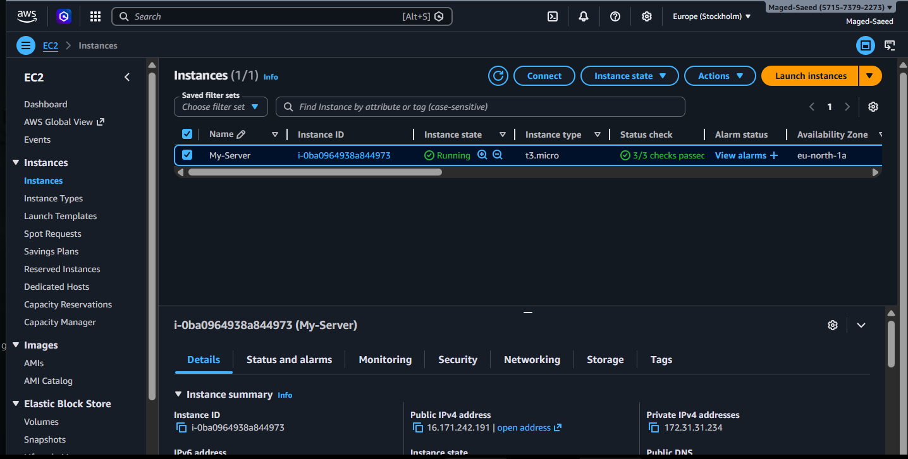
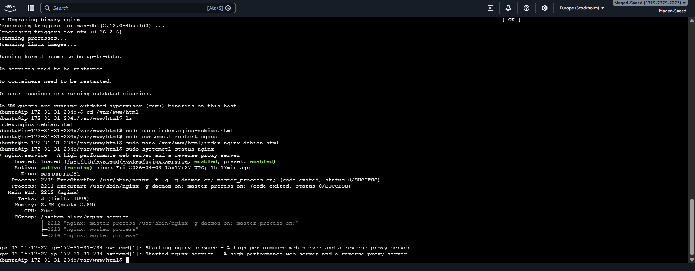

# AWS EC2 Nginx Project

This project demonstrates launching a web server using AWS EC2 with Ubuntu and Nginx.

## Overview
A virtual server was created on AWS, configured with Ubuntu, and used to deploy a simple web page using Nginx.

## Steps Performed
- Created an EC2 instance
- Connected to the server using SSH
- Installed Nginx
- Deployed a custom HTML page
- Accessed the website via public IP

## Tech Used
- AWS EC2
- Ubuntu Linux
- Nginx
- HTML

## Result
The website is live and accessible via public IP.

## Screenshots

## Author
Maged Saeed